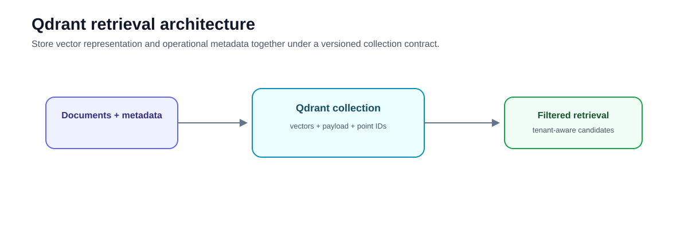
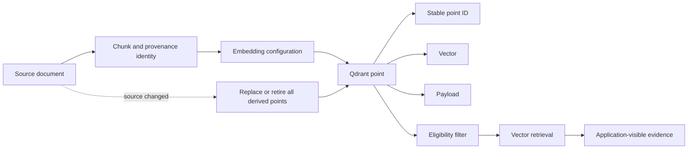
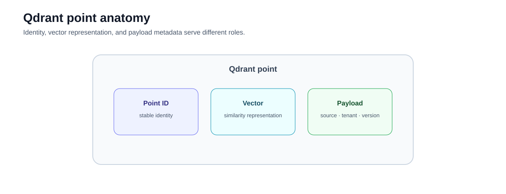
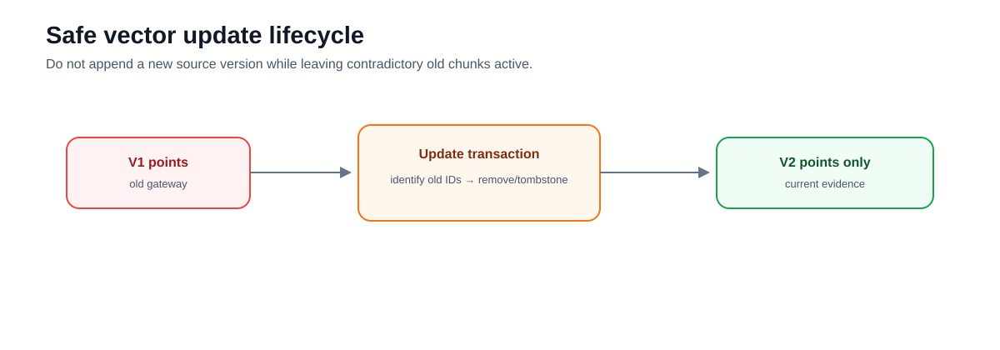

# Intermediate 06 — Local Qdrant: Collections, Payload Filters, and Versioned Vector Operations

**Level:** Intermediate

**Estimated time:** 3–4 hours

**Notebook:** [`06_qdrant_local.ipynb`](06_qdrant_local.ipynb)

**Prerequisites:** [Retrieval Strategies](../01-retrieval-strategies/README.md), [Metadata and Permissions](../02-metadata-permissions/README.md), and [RAG Evaluation](../04-evaluation/README.md)

**Next:** [Corrective RAG](../../advanced/01-corrective-rag/README.md)

> **Central rule:** A vector database is part of the retrieval contract. Manage vectors, payloads, IDs, filters, and versions as production data—not as disposable embeddings.

This revision preserves the original local-Qdrant identity, in-memory execution, tenant filter, stale-vector failure, collection/payload/versioning discussion, diagrams, and advanced-search references. The executable lab now applies those ideas to a realistic vector-database lifecycle instead of stopping after a two-document API demonstration.

## Learning outcomes

After completing the chapter and notebook, you can:

- explain what a Qdrant collection and point store;
- distinguish vectors, payloads, `chunk_id`, and `point_id`;
- define a collection contract explicitly before attaching a framework;
- create deterministic point IDs and idempotent upserts;
- inspect the payload shape produced for a LangChain integration;
- build tenant and compound filters from trusted application state;
- explain what payload indexes do and why not every field should be indexed;
- reproduce and repair a stale-vector update failure;
- delete every point derived from a multi-chunk source;
- separate current-answer eligibility from historical retention;
- compute labelled Recall@k and MRR without confusing them with ANN recall; and
- stage and validate a blue/green collection migration.

## Scenario, success criteria, and boundaries

You operate a support knowledge index for **Acme**, **Globex**, and **NovaTech**. The corpus contains runbooks, policies, architecture notes, current and historical versions, near duplicates, and identical text across tenants. Acme later changes checkout gateways, a legacy guide is withdrawn, and the embedding configuration must be migrated without an outage.

The notebook succeeds only when these final invariants hold:

```text
tenant isolation violations       = 0
stale current-version points      = 0
malformed indexed points          = 0
duplicate point IDs               = 0
labelled current evidence found   = yes
```

The lab is intentionally local and inspectable. It does **not** demonstrate production Qdrant performance, high availability, network security, distributed administration, or a universal metadata schema. It uses synthetic business and technical material only.

> Some data should not enter a RAG index at all. Credentials, passwords, API keys, access tokens, and private keys belong in appropriate secret-management systems. Payload authorization does not replace data minimization or secret management.

## Why this lesson exists

Earlier lessons used Chroma to keep retrieval mechanics simple. This lesson maps those concepts to explicit storage infrastructure using:

```python
from qdrant_client import QdrantClient, models
from langchain_qdrant import QdrantVectorStore

client = QdrantClient(":memory:")
```

Production RAG may use a dedicated vector/search database, a search engine, a relational database with vector support, or a managed retrieval service. The right choice depends on filters, corpus size, update rate, latency, operational ownership, isolation, and ecosystem fit. Qdrant is the implementation studied here—not the definition of RAG and not a universal prescription.

The important shift is from:

```text
embed documents → call similarity_search
```

to:

```text
define storage contract
→ validate transformed records
→ assign stable identity
→ ingest idempotently
→ enforce candidate eligibility
→ evaluate retrieval
→ reconcile updates/deletions
→ migrate versioned collections safely
```

## Mental model





The storage invariant is:

```text
source version
  → deterministic chunks
  → known point identities
  → declared embedding configuration
  → validated payload
```

If any link is missing, updates, deletion, provenance, filtering, or rollback become guesswork.

# Foundations and internal mechanics

## 1. Collection anatomy

A Qdrant collection contains points under one declared vector schema. A point contains:

```text
point ID
vector(s)
payload metadata
```



The vector is used for similarity search. The payload supports filtering, provenance, lifecycle, citations, and application logic. The point ID provides storage identity for upsert, retrieval, and deletion.

The lab creates its main collection explicitly:

```python
client.create_collection(
    collection_name="support_docs_v1",
    vectors_config=models.VectorParams(
        size=192,
        distance=models.Distance.COSINE,
    ),
)
```

This makes the collection name, vector dimension, and distance metric inspectable before the framework is connected. Qdrant's [collection documentation](https://qdrant.tech/documentation/manage-data/collections/) explains the current collection model and alias operations.

## 2. Vector configuration is a data contract

Every indexed vector and query vector must match the collection's declared representation. Important configuration includes:

```text
embedding_model
embedding version/configuration
vector_dimension
distance metric
chunking_version
```

Changing the embedding model, vector dimension, distance metric, or major chunking strategy changes the retrieval system. Do not silently mix incompatible vectors in one unnamed vector space.

The notebook uses a deterministic hashing embedder so it runs without downloads. That embedder is a teaching fixture, not a recommended production model. Its measured retrieval results are real for the committed corpus, but they do not claim general model quality.

## 3. Payload schema and transformation lineage

The lab expands the original two-document corpus to 27 synthetic chunks with metadata such as:

```python
{
    "tenant_id": "acme",
    "document_id": "acme-checkout-runbook",
    "chunk_id": "acme-checkout-runbook#gateway",
    "source": "acme-checkout-runbook.md",
    "document_version": "2",
    "document_type": "runbook",
    "status": "current",
    "valid_from": "2026-08-15",
    "valid_to": None,
    "is_deleted": False,
    "source_checksum": "...",
    "embedding_model": "teaching-hash-embedding-v1",
    "vector_dimension": 192,
    "chunking_version": "paragraph-v1",
    "indexed_at": "2026-09-01T12:00:00+00:00",
}
```

These names are a coherent fictional schema, not a universal standard. The general principle is:

> Indexed vectors represent a versioned transformation of source data.

`source_checksum` is a SHA-256 digest of the source-version text. The same `document_id` plus a changed checksum indicates that the source changed and should be reconciled. The checksum does not replace source identity or version policy.

## 4. Chunk identity versus point identity

Keep both concepts visible:

```text
chunk_id
= domain/provenance identity

point_id
= Qdrant storage identity
```

The lab maps them deterministically with UUIDv5:

```python
uuid.uuid5(
    namespace,
    f"{tenant_id}:{document_id}:{chunk_id}",
)
```

Python's built-in `hash()` is process-randomized and is not a stable storage identifier. UUIDv5 produces the same point ID for the same logical chunk across runs.

Historical snapshots need explicit provenance identity. In the lab, historical and current policy chunks use version-qualified chunk names such as:

```text
acme-incident-policy#v1-severity
acme-incident-policy#v2-severity
```

That permits both snapshots to coexist without making every active update append a second point.

This is one explicit teaching strategy, not a universal production model. Here, `chunk_id` carries both semantic chunk identity and snapshot identity. A production system may instead keep the logical chunk identity stable and represent historical versions through a separate snapshot ID, a versioned source key, or a versioned collection. Choose deliberately so provenance, replacement, and historical retrieval remain unambiguous.

## 5. Validation must happen before insertion

The notebook implements:

```python
validate_payload(...)
make_point_id(...)
ingest_records(...)
```

Required metadata includes tenant, document, chunk, version, status, embedding configuration, and chunking version. A malformed record missing `tenant_id` is rejected before insertion.

```text
missing tenant
unknown lifecycle status
invalid/deleted record state
        ↓
reject or quarantine
```

Do not index malformed security metadata and hope later filtering will compensate. This carries forward the fail-closed principle from [Intermediate 02 — Metadata and Permissions](../02-metadata-permissions/README.md).

## 6. Native storage first, framework adapter second

The main path uses `QdrantClient.upsert(...)` with explicit `PointStruct` objects. Payload is shaped to remain compatible with LangChain:

```python
{
    "page_content": "...",
    "metadata": {
        "tenant_id": "acme",
        "document_id": "...",
    },
}
```

Only after collection creation and ingestion does the notebook attach:

```python
QdrantVectorStore(
    client=client,
    collection_name=COLLECTION,
    embedding=embeddings,
    content_payload_key="page_content",
    metadata_payload_key="metadata",
)
```

This separation teaches the native storage model while still using the maintained [LangChain Qdrant integration](https://docs.langchain.com/oss/python/integrations/vectorstores/qdrant) for convenient `Document` reconstruction and query embedding.

## 7. Inspect actual payload structure

After ingestion, the notebook scrolls raw Qdrant points with payloads and vectors enabled. It displays:

```text
point ID
top-level payload keys
metadata.tenant_id
metadata.chunk_id
vector presence
vector dimension
```

Because this integration-compatible shape nests metadata, filter paths use:

```text
metadata.tenant_id
metadata.document_id
metadata.status
metadata.document_type
```

When using the Qdrant client directly, you may choose flat payloads instead. Never copy field paths from a tutorial without verifying the payload that your exact integration writes.

## 8. Upsert and idempotency

Qdrant upsert inserts a point when its ID is absent and replaces it when the ID exists. Stable IDs make repeated ingestion idempotent with respect to point count:

```text
ingest 27 chunks → 27 points
ingest the same 27 chunks again → still 27 points
```

The lab records:

```text
points inserted
points updated
points deleted
points rejected
collection point count
```

These counters are cumulative ingestion operations, not current unique-point counts. For example, 27 inserts followed by 27 updates still leave 27 current points when the IDs are stable.

This is observable teaching instrumentation, not a monitoring stack. In production, add an ingestion ledger, retry classification, durable job state, source reconciliation, and alerts.

## 9. Payload filtering and trusted scope

The notebook centralizes filter construction:

```python
def build_filter(tenant_id, status="current", document_type=None, document_id=None):
    ...
```

Tenant identity must come from trusted authentication and authorization state, not query text. A request such as:

```text
Search Globex documents.
```

does not mutate:

```python
principal["tenant_id"] == "acme"
```

The storage/retrieval layer must enforce eligibility before unauthorized evidence enters model-visible or application-visible intermediate state. Do not move that decision into the LLM.

The notebook also demonstrates compound filtering:

```text
tenant_id == acme
AND status == current
AND document_type == runbook
```

Qdrant provides a typed filter model; its official [filtering documentation](https://qdrant.tech/documentation/concepts/filtering/) covers `must`, `should`, `must_not`, matches, ranges, and nested fields.

## 10. Payload indexes and query planning

A stored payload field is not automatically a payload index. The lab requests keyword indexes before bulk ingestion for frequently filtered fields:

```text
metadata.tenant_id
metadata.document_id
metadata.status
metadata.document_type
```

Qdrant's [indexing documentation](https://qdrant.tech/documentation/manage-data/indexing/) explains that payload indexes accelerate filtering and provide cardinality estimates used by query planning. They consume memory/storage and build resources, so select fields based on:

- filter frequency;
- cardinality and selectivity;
- expected workload;
- memory and storage cost; and
- measured latency and recall behavior.

Do not index every metadata field by default.

The in-memory client accepts `create_payload_index(...)` but warns that payload indexes have no execution effect in local mode. The notebook prints both the intended index plan and the backend-reported payload schema. A server deployment should inspect the actual schema and test representative filters.

Avoid universal claims about internal filtering order. Qdrant's [search documentation](https://qdrant.tech/documentation/search/search/) describes current query-planning strategies, including cardinality estimation, full scan, payload-index retrieval, filterable vector indexes, and ACORN for some workloads. Exact choices depend on collection size, segment state, indexes, filter selectivity, configuration, and release. Verify the backend you deploy.

# Architecture patterns and technology choices

## 11. Isolation architecture is a risk decision

Payload filtering is one architecture, not the only one.

| Pattern | Strength | Cost / limitation | Typical fit |
|---|---|---|---|
| Shared collection + trusted payload filters | Operational simplicity and efficient shared capacity | Metadata/filter errors have a larger blast radius | Many small tenants with rigorous policy and tests |
| Tenant-specific collections or namespaces | Clearer logical lifecycle and isolation boundary | More routing, schema, and collection operations | Medium/high-risk tenant separation |
| Tenant-specific service/index | Stronger operational blast-radius isolation | Highest capacity and operational overhead | Regulated or very large tenants |
| Database/search row-level authorization | Reuses an existing policy boundary | Backend-specific vector/search semantics | Teams centered on relational or search platforms |

Choose based on data sensitivity, legal requirements, tenant count and size, backend guarantees, operational maturity, and recovery needs. Database authentication does not replace per-request application authorization.

## 12. Current versus historical storage

The lab keeps both historical policy V1 and current policy V2, then uses explicit lifecycle filters:

```text
historical storage ≠ current answer eligibility
```

Fields such as `status`, `valid_from`, `valid_to`, `is_deleted`, and `superseded_by` support lifecycle policy. The notebook keeps date logic simple and filters by `status`. Production policy should define how clock time, legal hold, deletion, supersession, and reconciliation interact.

## 13. Source replacement and deletion

The original stale-vector example remains central:

```text
V1 remains
+
V2 inserted
=
contradictory current index
```



The notebook first performs that bad update. It deliberately gives V2 version-qualified point IDs, so both Stripe V1 and Adyen V2 survive as `current` evidence. It then implements:

```python
replace_document_version(...)
```

The lifecycle is:

```text
source v1
   ↓
identify all points for tenant + document_id
   ↓
delete/tombstone old points
   ↓
insert v2 under stable logical point IDs
   ↓
assert old version absent
   ↓
assert new version searchable
```

Qdrant's [point-management documentation](https://qdrant.tech/documentation/manage-data/points/) describes current upsert, vector/payload update, and point-deletion operations.

Deleting one source means deleting **all** derived points. The lab removes a three-chunk legacy guide by `tenant_id + document_id` and verifies the count becomes zero. Deleting one remembered vector ID would be incomplete.

In concurrent production ingestion, delete-then-insert requires stronger controls: source-state transitions, conditional updates or version preconditions, durable job state, retries, and reconciliation. A tombstone or blue/green projection may be preferable when temporary absence is unacceptable.

## 14. Collection and embedding migration

For an embedding-model/configuration change, use a new collection or a deliberately designed named-vector migration. The notebook demonstrates:

```text
support_docs_v1
    ↓ retain
build support_docs_v2
    ↓ validate point count and vector schema
run the same retrieval evaluation
    ↓
evaluate explicit safety and Recall@3 release gates
    ↓ pass                         ↓ fail
atomically promote alias       keep V1 active
    ↓                             ↓
retain V1 for rollback         diagnose and improve V2
```

Qdrant collection aliases are designed for atomic collection switching; see the official [collection alias documentation](https://qdrant.tech/documentation/manage-data/collections/#collection-aliases). The teaching lab uses a second deterministic embedder rather than downloading an expensive model. The migration workflow is real; the embedder comparison is not a model benchmark.

# Technology landscape and state of the art

## 15. Retrieval infrastructure choices

| Family | Strengths | Limitations | Selection signal |
|---|---|---|---|
| Dedicated vector/search database such as Qdrant | Vector-native collection model, filters, hybrid/multivector features, operational APIs | Another service and operating model | Vector-heavy workload and search-specific lifecycle needs |
| Search engine with vector support | Mature lexical search, filters, analytics, hybrid ecosystem | Vector behavior and operations vary | Existing search platform and strong lexical/filter requirements |
| Relational database with vector extension | Transactions, joins, familiar SQL and governance | ANN scale/features depend on extension and topology | Data already governed relationally; moderate vector workload |
| Managed retrieval/vector service | Reduced infrastructure ownership | Portability, cost, visibility, and feature constraints | Small platform team or managed-cloud preference |
| Embedded/in-process vector search | Simple local/offline deployment | Process-level durability and scale boundaries | Edge, local development, bounded datasets |

Evaluate the specific product and version. A feature checklist does not substitute for labelled retrieval tests, operational failure drills, isolation review, and total-cost analysis.

## 16. Established, emerging, and advanced Qdrant patterns

**Established practice in this course:** explicit collection contracts, stable point identity, validated payloads, tenant/lifecycle filters, payload-index planning, idempotent ingestion, source-level delete/replace, versioned collections, and retrieval regression tests.

**Adopted advanced search patterns:** dense+sparse hybrid retrieval, rank/score fusion, named vectors, multi-stage candidate retrieval, quantization, and reranking. Use them when a labelled workload shows a quality, latency, or memory need.

**Specialized/emerging practice:** multivectors, late-interaction models such as ColBERT, multi-representation retrieval, and increasingly filter-aware ANN planning. These add index, serving, evaluation, and migration complexity.

**Open operational problems:** low-disruption re-embedding at scale, maintaining semantic quality across model updates, tenant-aware capacity balancing, evaluation under continuously changing corpora, and reconciling source-of-truth deletion with derived indexes.

### Dense and sparse retrieval

Dense vectors capture semantic similarity; sparse representations preserve lexical behavior. Current Qdrant supports server-side hybrid queries and fusion. Use hybrid retrieval when evaluation shows complementary failure modes—not merely because the backend supports it.

### RRF versus score fusion

Reciprocal Rank Fusion combines ranks. Distribution-based score fusion normalizes score distributions. Neither should be described generically as score averaging, and fusion choices should be tuned on relevance data. See Qdrant's [hybrid query documentation](https://qdrant.tech/documentation/search/hybrid-queries/) and [hybrid search guide](https://qdrant.tech/documentation/search/text-search/hybrid-search/).

### Named vectors

Named vectors can preserve separate representations such as:

```text
title embedding
body embedding
summary embedding
```

Do not collapse them into one vector without testing the retrieval trade-off.

### Multivectors and late interaction

Multivectors store several same-shaped vectors per point and can support late-interaction representations. They can improve fine-grained matching while increasing storage and query cost. They remain an extension here so the core lab stays focused on storage identity and lifecycle.

### HNSW and quantization

HNSW uses a navigable graph for approximate nearest-neighbor search. Parameters trade build time, memory, latency, and ANN recall. Quantization can reduce memory and change approximation behavior. Neither automatically improves application quality.

Keep the layers separate:

```text
HNSW approximation quality
      ↓
vector-neighbor quality
      ↓
semantic retrieval relevance
      ↓
downstream RAG quality
```

# Guided notebook walkthrough

## 17. Baseline and corpus inspection

The notebook creates 27 chunks across 11 source documents and three tenants. It includes:

- identical escalation text in Acme and Globex;
- similar but tenant-specific gateway runbooks;
- Acme incident-policy V1 historical and V2 current;
- three chunks from one legacy source that will later be deleted;
- runbook, policy, architecture, and guide types; and
- source checksum, embedding, chunking, validity, and indexing metadata.

This corpus is intentionally small enough to inspect while complex enough to expose lifecycle and filter failures.

## 18. Experiment 1 — unfiltered versus authorized retrieval

The query contains the same escalation sentence and asks to search Globex. The unfiltered baseline returns both tenants. The secure wrapper derives the filter from an Acme principal and returns Acme evidence only.

The failure is visible before any LLM is invoked. If forbidden metadata appears in retrieval output, a trace, a cache, or a debugging interface, the security boundary has already failed.

## 19. Experiment 2 — compound filtering

The notebook retrieves only records satisfying:

```text
tenant_id == acme
AND status == current
AND document_type == runbook
```

This demonstrates why a vector store's filter model is part of retrieval infrastructure rather than a UI convenience.

## 20. Experiment 3 — bad update, correct replacement, and deletion

The bad update makes both checkout V1 and V2 current. The repair deletes every point for Acme's checkout document, inserts V2 with stable point IDs, and asserts:

```text
old version count = 0
new version count = number of V2 chunks
```

The notebook then deletes a separate three-chunk guide by document identity and verifies every derived point disappears.

## 21. Experiment 4 — current and historical retrieval

The same tenant can retain both historical and current policy evidence. Two explicit queries show that current answers exclude superseded history while a deliberate historical query can still retrieve it.

## 22. Experiment 5 — retrieval evaluation

The notebook uses 12 labelled, tenant-scoped queries and computes:

```text
Recall@3
MRR
mean local latency
tenant violations
```

For one query with expected evidence set `E` and retrieved IDs `R_k`:

```text
Recall@k = |E ∩ R_k| / |E|
```

MRR uses the reciprocal rank of the first expected chunk. Any cross-tenant result is counted separately and must remain zero.

Moving storage backends or changing vector configuration does not guarantee equivalent retrieval behavior. The lab runs the same evaluation before and after collection migration.

## 23. ANN recall is not retrieval relevance

**ANN recall** asks:

> Did approximate search recover the neighbors exact vector search would have returned?

**Retrieval relevance** asks:

> Were the returned neighbors useful evidence for the task?

The notebook compares `SearchParams(exact=True)` with configured non-exact search and records exact-neighbor overlap, labelled Recall@3, MRR, and latency. Qdrant local mode reports that it performs brute-force exact search, so search parameters have no effect beyond supported exceptions. The experiment therefore teaches measurement and API semantics; it is not a production HNSW benchmark.

## 24. Experiment 6 — blue/green migration

The lab creates `support_docs_v2` with a different vector dimension and embedding configuration, re-ingests the source records with updated metadata, validates schema and point count, and reruns the same Recall@3 evaluation. It then applies an explicit release gate before any alias switch. In the executed lesson, V2 improves MRR but regresses Recall@3 beyond the declared budget, so promotion is **blocked** and V1 remains active.

The teaching notebook reconstructs V2 records by scrolling V1 for local convenience. Production reindexing should normally rebuild from the authoritative corpus or immutable source/chunk manifest. Treating an old vector index as source of truth can copy stale omissions, corrupt metadata, or incomplete ingestion into the replacement.

The release conditions are independent and fail closed:

```text
tenant violations = 0
Recall@3 >= 0.95
Recall@3 regression <= 0.02
point counts match
vector schema matches
```

Recall@5 is retained as a discoverability diagnostic, not a substitute success criterion. A wider candidate budget can help diagnose ranking depth, but it cannot erase a Recall@3 regression or authorize promotion after the gate has failed.

The measured V1/V2 metrics are generated by executing the notebook. They are not hand-authored benchmark claims. The controlled result deliberately demonstrates a blocked release rather than tuning the threshold after observing a miss. A production gate should use a representative corpus and query distribution, slice results, latency percentiles, capacity data, and failure tests.

# Evaluation and failure analysis

## 25. Evaluation matrix

| Layer | Metric or invariant | What it diagnoses |
|---|---|---|
| Candidate eligibility | tenant violations | Authorization/filter boundary failure |
| Lifecycle | stale current-version points | Update/reconciliation failure |
| Ingestion | malformed indexed points | Validation/fail-closed failure |
| Identity | duplicate logical IDs / point count growth | Non-idempotent ingestion or bad key design |
| Relevance | Recall@k | Missing labelled relevant evidence |
| Ranking | MRR | Expected evidence appears too low |
| Approximation | exact-neighbor overlap@k | ANN diverges from exact vector neighbors |
| Operations | latency and counters | Workload and lifecycle behavior |
| Migration | schema, count, evaluation parity | Unsafe promotion risk |

Do not collapse these into one score. A retrieval system can have excellent MRR and still leak another tenant. It can have perfect ANN recall while the embedding model retrieves semantically useless neighbors.

## 26. Common failure modes and controls

| Failure | Observable symptom | Control |
|---|---|---|
| Random point IDs | repeated ingestion doubles count | Deterministic UUIDv5 or source→point manifest |
| Version in every active point ID | V1 and V2 both remain current | Stable logical identity or explicit source replacement |
| Missing tenant metadata | record cannot be safely scoped | Fail-closed ingestion validation and quarantine |
| Inline filter construction | call sites enforce different policy | Centralized trusted filter builder |
| Post-search tenant filtering | forbidden evidence enters traces/intermediate state | Enforce eligibility in retrieval/storage request |
| Deleting one chunk | remainder of deleted source remains searchable | Delete by stable document identity or complete point manifest |
| Mixing embedding configurations | meaningless similarity in one vector space | Version metadata and new collection/named-vector migration |
| Index every payload field | unnecessary memory/build cost | Index frequent, selective filter fields and measure |
| Treat local latency as production | false capacity expectations | Server load test with representative data and filters |
| Promote on point count only | relevant evidence regresses | Labelled retrieval and safety gates before alias switch |
| Put secrets in payloads | credential exposure through search/logs/backups | Data minimization and dedicated secret management |

# Production considerations

## 27. Local versus production

| In-memory lab | Production |
|---|---|
| Process-local | Service or cluster |
| Ephemeral | Persistent storage and recovery objectives |
| No network boundary | Authentication, TLS, firewall/network policy |
| Single process | Replication, capacity, upgrades, failure domains |
| Tiny corpus | Representative capacity and index planning |
| Printed counters | Metrics, traces, alerts, reconciliation dashboards |
| Manual migration | Shadow/canary evaluation, atomic promotion, rollback |

Never expose an unauthenticated Qdrant service to an untrusted network. Use scoped credentials and network controls, and ensure application authorization determines every tenant-sensitive filter.

## 28. Production ingestion lifecycle

A production ingestion service should add:

1. immutable source snapshots or a trustworthy source-of-truth pointer;
2. deterministic chunking and a source→chunk manifest;
3. content checksums and no-op detection;
4. schema and security-metadata validation;
5. idempotency keys and retry classification;
6. source lifecycle state such as pending, current, superseded, deleted, or quarantined;
7. bounded concurrency and backpressure;
8. durable checkpoints around delete/replace operations;
9. reconciliation between the source system and Qdrant;
10. collection/schema/model/version telemetry; and
11. evaluation and rollback gates before migration promotion.

## 29. Authorization, logs, and caches

The notebook centralizes tenant filtering but does not recreate the complete authorization lesson. Production design must also protect:

- caches and cache keys;
- query/result traces;
- citation previews;
- dashboards and debugging tools;
- evaluation exports; and
- backup/restore operations.

Any cache of retrieval results must include authorization scope, policy version, index/collection version, and relevant lifecycle state. A correct Qdrant filter cannot prevent a query-only cache key from returning another principal's result.

## 30. Operational release gate

Before promoting a collection version, verify at least:

```text
collection schema and vector dimensions
expected payload index schema
point and source counts
malformed/quarantined record counts
tenant and policy negative tests
current/historical lifecycle invariants
Recall@k / MRR by query slice
ANN recall against exact search where applicable
latency and resource targets
backup/rollback readiness
```

Point-count parity is necessary but insufficient. A collection can contain every point and still return worse evidence because of embedding, chunking, filter, or search-parameter changes.

# Exercises and checkpoint

## 31. Exercises

1. Add a `must_not` filter for tombstoned records and a negative test.
2. Add a fourth tenant with identical escalation text and prove isolation.
3. Simulate a crash between delete and insert; design a recoverable replacement state machine.
4. Add a source manifest and skip re-ingestion when `source_checksum` is unchanged.
5. Improve the V2 candidate until it passes the existing gate, then build `support_docs_v3` from an authoritative source manifest with a changed chunking policy.
6. Run the notebook against a local Qdrant server and compare payload-schema inspection with in-memory mode.
7. Add a small dense+sparse RRF extension only after defining a lexical-miss slice and baseline.
8. Compare shared-collection filtering with tenant-specific collections for this corpus.
9. Add a historical-as-of policy rather than the simple `status` field.
10. Write a reconciliation report that detects source records missing from Qdrant and orphan Qdrant points.

## 32. Checkpoint

1. Why is a Qdrant collection schema part of the retrieval contract?
2. How do `chunk_id` and `point_id` differ?
3. Why is UUIDv5 preferable to Python `hash()` for stable IDs?
4. Why does upserting V2 under a new ID leave stale evidence?
5. Why must source deletion operate across all derived chunks?
6. Why does a stored payload field not imply a payload index?
7. Which payload fields should be indexed, and how would you decide?
8. Why can historical storage be valid while historical evidence is ineligible for a current answer?
9. How is ANN recall different from labelled Recall@k?
10. Why must retrieval evaluation be rerun after a collection or embedding migration?
11. What does local in-memory mode fail to demonstrate?
12. Which controls belong outside Qdrant itself?

## References

- Qdrant — [Documentation](https://qdrant.tech/documentation/)
- Qdrant — [Local quickstart](https://qdrant.tech/documentation/quickstart/)
- Qdrant — [Collections and collection aliases](https://qdrant.tech/documentation/manage-data/collections/)
- Qdrant — [Points, upserts, updates, and deletion](https://qdrant.tech/documentation/manage-data/points/)
- Qdrant — [Payload filtering](https://qdrant.tech/documentation/concepts/filtering/)
- Qdrant — [Payload indexing](https://qdrant.tech/documentation/manage-data/indexing/)
- Qdrant — [Search and query planning](https://qdrant.tech/documentation/search/search/)
- Qdrant — [Bulk upload and index-order guidance](https://qdrant.tech/documentation/tutorials/bulk-upload/)
- Qdrant — [Hybrid queries and RRF](https://qdrant.tech/documentation/search/hybrid-queries/)
- Qdrant — [Hybrid search](https://qdrant.tech/documentation/search/text-search/hybrid-search/)
- LangChain — [Qdrant integration](https://docs.langchain.com/oss/python/integrations/vectorstores/qdrant)
- Malkov and Yashunin — [Efficient and Robust Approximate Nearest Neighbor Search Using Hierarchical Navigable Small World Graphs](https://arxiv.org/abs/1603.09320)

## Key takeaway

**A vector database is part of your retrieval contract. Manage vectors, payloads, IDs, filters, and versions as production data—not as disposable embeddings.**
