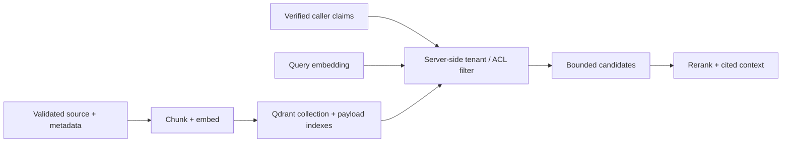

# 06 — Local Qdrant, embeddings, and payload filters

**Level:** Intermediate  
**Time:** 2–3 hours  
**Prerequisites:** [metadata and permissions](../02-metadata-permissions/README.md), [query planning and reranking](../03-query-reranking/README.md), and [evaluation](../04-evaluation/README.md)

## Learning objectives

After this lesson you will be able to:

- explain the HNSW index structure and the recall-latency trade-off it creates;
- compare vector database architectures (pgvector, Elasticsearch, Weaviate, Qdrant, Pinecone) and select based on operational requirements;
- design a Qdrant collection as a versioned retrieval contract;
- ingest embeddings idempotently with stable point IDs;
- apply tenant and ACL filters inside vector search using payload indexes;
- design an embedding migration lifecycle (new model → new collection → gradual promotion);
- implement caching strategies (embedding cache, semantic cache, retrieval cache) with tenant-safe keys; and
- optimize retrieval performance through batching, parallel retrieval, and index configuration.

## Outcome

Move from an inspectable local retriever to a vector-service contract: design a collection, validate payload/provenance, ingest embeddings idempotently, apply tenant filters inside vector search, evaluate results, and prepare for hybrid retrieval and operational change.

## Guided notebook

Open [`qdrant_local.ipynb`](qdrant_local.ipynb). The optional adapter is [`lab.py`](lab.py). The core notebook runs without Docker; the final section gives an optional local Qdrant and Sentence Transformers path.



---

## Vector database landscape and selection

The choice of vector store is an operational engineering decision, not a
retrieval algorithm decision. Most mature vector stores implement HNSW or
equivalent ANN structures internally. The meaningful differences are:

| Database | Architecture | Best fit | Notes |
|---|---|---|---|
| **Qdrant** | Purpose-built, Rust, HNSW | RAG with rich payload filtering, hybrid search, production operations | Excellent filtering before search; strong multitenancy support |
| **pgvector** | PostgreSQL extension | Existing Postgres stack; ACID requirements; small-medium scale | Simpler ops; SQL joins; lower ANN performance at large scale |
| **Elasticsearch / OpenSearch** | Inverted index + HNSW | Existing Elastic stack; strong BM25 baseline; hybrid search | Mature operational tooling; more complex configuration |
| **Weaviate** | Modular, Go, HNSW | Multi-modality; schema-enforced collections; GraphQL API | Built-in module ecosystem |
| **Milvus / Zilliz** | Distributed, C++, multiple index types | Very large scale (billions of vectors); analytics | Higher operational complexity |
| **Pinecone** | Managed SaaS | Teams that want zero infrastructure management | Less control over index configuration |
| **Chroma** | Python, in-memory/local | Local development and prototyping | Not designed for production multitenancy |

**Selection principle:** choose based on your existing operational stack, team
expertise, filtering needs, and scale requirements — not on benchmark comparisons
alone. A well-operated pgvector instance beats a misconfigured Qdrant cluster.

---

## HNSW mechanics and the recall-latency trade-off

Every major vector store uses HNSW (Hierarchical Navigable Small World) or a
derivative for approximate nearest neighbor search. Understanding the mechanics
helps you configure indexes correctly.

### How HNSW works

HNSW builds a multi-layer graph where:
- **Layer 0** contains all nodes with short-range connections
- **Higher layers** contain fewer nodes with longer-range connections (like highway links)
- **Search** starts at the top layer, navigates toward the query, descends to Layer 0

This gives O(log N) query complexity vs O(N × D) for exact search.

### Key parameters

| Parameter | What it controls | Impact |
|---|---|---|
| `m` | Number of bidirectional links per node | Higher → better recall, more memory, slower build |
| `ef_construction` | Candidate list size during build | Higher → better index quality, slower indexing |
| `ef` / `hnsw_ef` | Candidate list size during search | Higher → better recall, slower query |
| `on_disk` | Whether vectors live in RAM or on disk | Disk → lower cost, higher latency |

### Recall-latency trade-off

```
ef=16  → ~1-2ms per query, Recall@10 ≈ 93-95%
ef=64  → ~3-5ms per query, Recall@10 ≈ 97-98%
ef=256 → ~15-25ms per query, Recall@10 ≈ 99-99.5%
```

**Key insight:** for most production RAG systems, 97-99% ANN recall is
sufficient. The remaining 1-3% miss rate translates to rare retrieval failures
that evaluation and corrective RAG can handle. The latency at ef=16 vs ef=64
matters far more for user experience.

**Filter interaction:** when a heavy payload filter restricts the candidate pool
to a small fraction of the index, HNSW recall can degrade significantly (the
graph was built for the full index). Qdrant's automatic pre-filter mode switches
to exact search when the filtered set is small — a feature that preserves recall
at the cost of slightly higher latency.

---

## 1. Local environment and security boundary

Install optional dependencies and run Qdrant locally:

```bash
pip install -e '.[qdrant]'
docker compose up -d qdrant
curl http://localhost:6333/healthz
```

Qdrant's local quickstart uses REST on `6333`, gRPC on `6334`, and a local
dashboard. A default local instance has no authentication or encryption, so it
is for trusted local development — not a publicly reachable production service.
Persist storage deliberately, keep secrets out of notebooks, and destroy test
data when finished.

**Production deployment:** add API key authentication, TLS, network segmentation,
and least-privilege service accounts before any production use.

---

## 2. The collection as a versioned retrieval contract

A collection defines vector size and distance; it is not merely a bucket of
text. The embedding model, chunking scheme, normalization assumptions, distance
metric, payload schema, index configuration, and corpus revision form one
**versioned retrieval contract**. Do not add vectors from incompatible embedding
models into one unnamed vector field.

```python
from qdrant_client.models import VectorParams, Distance

client.create_collection(
    collection_name="northstar-support-v3",  # version in the name
    vectors_config=VectorParams(size=384, distance=Distance.COSINE),
)
```

**Versioning discipline:** when you change any of the following, create a new
collection:
- embedding model or model version
- chunking strategy or chunk size
- distance metric
- normalization approach

Mixing vectors from different models in one collection produces incorrect
similarity computations that are silent and hard to debug.

### Payload schema contract

| Payload field | Purpose | Why it matters |
|---|---|---|
| `text` | Retrievable chunk | Context/citation rendering |
| `source`, `chunk_id` | Stable provenance | Audit and exact citation |
| `tenant_id`, `tags` | Authorization filter inputs | Cross-tenant/role isolation |
| `source_version` | Freshness/reproducibility | Explain and roll back results |
| `valid_from`, `valid_to` | Temporal filtering | Freshness RAG |
| `is_deleted` | Tombstone | Logical deletion without data loss |
| `embedding_model` | Which model generated this vector | Mixing detection |
| `chunk_strategy` | Which chunking configuration | Re-indexing provenance |
| optional title/date/type | Ranking/filtering | Query-specific relevance |

Validate required metadata at ingestion and inherit it to each chunk. The lab
fails closed when tenant, provenance, or version fields are absent.

---

## 3. Ingest idempotently and index filter fields

Use stable point IDs derived from source/chunk identity (e.g., SHA-256 of
source path + chunk ordinal). Upsert batches with a recorded corpus revision
and wait for completion when a lab/test needs read-after-write behavior.

```python
# Stable point ID
point_id = sha256(f"{source}:{chunk_id}").hexdigest()[:32]
```

**Create payload indexes** for fields frequently used in filters:

```python
client.create_payload_index(
    collection_name="northstar-support-v3",
    field_name="tenant_id",
    field_schema="keyword",
)
client.create_payload_index(
    collection_name="northstar-support-v3",
    field_name="valid_to",
    field_schema="datetime",
)
```

Without payload indexes, Qdrant must scan all points to apply filters — correct
but slow at scale. Index all fields used in authorization, freshness, and type
filters before going to production.

Do not put raw credentials, PII, or unrestricted sensitive data into payload
simply because it is convenient to return with a hit.

---

## 4. Filter inside search, then verify again

Build a server-side `Filter` from verified caller claims; never accept a tenant
identifier chosen by the query text or model. Apply equivalent authorization to
lexical, dense, hybrid, reranking, cache, and citation paths.

```python
filter_contract = payload_filter("acme", required_tags={"support"})
# {"must": [{"key": "tenant_id", ...}, {"key": "tags", ...}]}
```

The adapter requires `tenant_id` so an unfiltered search is not a convenient default.

**Freshness filter at query time:**

```python
from datetime import date

freshness_filter = models.Filter(must=[
    models.FieldCondition(key="valid_from", range=models.DatetimeRange(lte=date.today().isoformat())),
    models.FieldCondition(key="valid_to", range=models.DatetimeRange(gte=date.today().isoformat())),
    models.FieldCondition(key="is_deleted", match=models.MatchValue(value=False)),
])
```

---

## 5. Caching strategies

Caching reduces latency and cost. Each layer has different semantics and
different security requirements.

### Embedding cache

Cache computed embeddings keyed by text content (and embedding model version).
When the same text is embedded repeatedly, return the cached vector.

```python
cache_key = hash(text + embedding_model_version)
```

**Safe for:** text content that is not user-specific or tenant-specific.  
**Dangerous if:** embedding model version is not in the key (stale vectors served
after model upgrade), or if user-supplied text carries sensitive content that
should not persist in cache.

### Retrieval cache

Cache the results of a specific (query, filter, collection, config) combination.

```python
cache_key = hash(
    query_text,
    tenant_id,
    frozenset(roles),
    collection_version,
    index_version,
    corpus_snapshot_timestamp,
)
```

**Security requirement:** tenant_id and roles must always be in the key. Two
users from different tenants making the same query must never share a cache entry.

**TTL policy:** retrieval caches must expire when the corpus is updated. Use
event-driven invalidation (index update triggers cache purge) or a short TTL
aligned to your index freshness SLO.

### Semantic cache

Cache by semantic similarity of the query to prior queries, not by exact text match.
Retrieve results for a prior query whose embedding is close to the current query.

```python
# Store prior (query, result) pairs in a separate vector index
semantic_cache_results = semantic_cache.search(query_embedding, threshold=0.97)
```

**Advantage:** handles paraphrased queries with the same answer.  
**Risk:** requires a very high threshold — a slightly different query may have
a very different correct answer. Cache poisoning via adversarial similar queries.
**Tenant safety:** the semantic cache must also be partitioned by tenant.

### Generation cache

Cache final generated answers for exact (query, context) pairs. The most
aggressive cache — useful for high-traffic FAQ scenarios but risky for any
dynamic or personalized content.

**Never cache** answers to queries where the answer depends on real-time data,
user-specific context, or mutable corpus state.

---

## 6. Embedding migration lifecycle

When you need to change embedding models (new release, domain adaptation,
dimensionality change), plan the migration:

```
Phase 1: New collection
  → Create collection with new model name and version in the collection name
  → Re-embed entire corpus into new collection
  → Validate: ANN recall on golden set ≥ threshold
  → Validate: payload schema is complete and correct

Phase 2: Shadow mode
  → Run queries against both old and new collections
  → Compare candidate sets and evaluate differences on golden set
  → Monitor: do results on golden set improve?

Phase 3: Canary promotion
  → Route a small percentage of traffic to new collection
  → Monitor: latency, error rate, and user feedback
  → Monitor: do metrics match shadow mode predictions?

Phase 4: Full promotion
  → Route all traffic to new collection
  → Keep old collection for rollback window (7-30 days)

Phase 5: Decommission
  → After rollback window, delete old collection
  → Update all version references in evaluation artifacts
```

**Zero-downtime guarantee:** both collections must be operational and receiving
updates during the shadow and canary phases. If a new document is ingested during
migration, it must be indexed in both collections.

---

## 7. Evolve toward hybrid retrieval and reranking

Dense vectors improve semantic/paraphrase matching but can miss exact IDs and
rare terms. Maintain a lexical/hybrid baseline and evaluate candidate recall.
Qdrant supports dense, sparse, hybrid, multi-vector, and reranking-oriented
patterns; introduce one representation at a time and measure quality, p95,
memory, indexing time, and cost.

**Hybrid retrieval in Qdrant:** combine dense and sparse vector searches with
Qdrant's `Query` API using prefetch and fusion.

Rerank only a bounded authorized candidate set.

---

## 8. Performance optimization

### Batching

Embed multiple chunks together in one model call rather than one at a time:

```python
# Slow: one embed call per chunk
for chunk in chunks:
    vector = embed(chunk.text)

# Fast: batch all chunks
vectors = embed_batch([chunk.text for chunk in chunks])
```

Typical speedup: 5–20× depending on batch size and hardware.

### Parallel retrieval

For multi-query or multi-source retrieval, run retrievals in parallel:

```python
import asyncio

results = await asyncio.gather(
    qdrant_client.search_async(..., query_vector=query_v1),
    qdrant_client.search_async(..., query_vector=query_v2),
)
```

### Connection pooling

Reuse HTTP/gRPC connections to the vector store. Creating a new connection per
request adds 10–50ms of latency. Configure connection pooling in the Qdrant
client.

### Index on frequently filtered fields

As noted above, payload indexes are critical for filter performance at scale.
A collection with 10M points and no payload index on `tenant_id` will scan
all 10M points for every filtered query.

---

## 9. Production readiness checklist

- [ ] Model/chunking/corpus/payload/index versions are traceable together.
- [ ] Tenant and ACL filters are generated from authenticated identity.
- [ ] Payload indexes match frequent filter fields and are load-tested.
- [ ] Upserts, deletes, source revocation, and embedding migrations are tested.
- [ ] Snapshot/restore, monitoring, capacity limits, and rollback procedures exist.
- [ ] Evaluation includes exact IDs, paraphrases, no-answer, freshness, and tenant-isolation slices.
- [ ] Network authentication, TLS, backups, and least-privilege service access are configured before production.
- [ ] Cache keys include all authorization-relevant dimensions.
- [ ] Embedding migration procedure is documented and tested before any model change.

---

## Exercises

1. Add Acme and Globex documents with nearly identical wording. Prove an Acme
   search never returns a Globex point — even for exact text.
2. Add `valid_to` and exclude expired chunks before vector search.
3. Compare local BM25 against vectors for an error code and a paraphrase;
   record Recall@K, p95 latency, and index/memory cost.
4. Version a second embedding model in a new collection and design a blue/green
   migration with a rollback test.
5. Implement a retrieval cache with tenant-safe key design. Prove two tenants
   with the same query get different cache entries.
6. Measure the performance impact of adding a payload index to `tenant_id` on a
   collection of 10K points with a 50% tenant-filtered query load.

## References

- Qdrant, [local quickstart](https://qdrant.tech/documentation/quickstart/)
- Qdrant, [collections](https://qdrant.tech/documentation/manage-data/collections/), [filtering](https://qdrant.tech/documentation/search/filtering/), and [hybrid queries](https://qdrant.tech/documentation/search/hybrid-queries/)
- Qdrant, [payload indexes](https://qdrant.tech/documentation/concepts/indexing/)
- Qdrant, [production checklist](https://qdrant.tech/documentation/production-checklist/)
- Sentence Transformers, [semantic search](https://www.sbert.net/examples/sentence_transformer/applications/semantic-search/README.html)
- Malkov and Yashunin, [Efficient and Robust Approximate Nearest Neighbor Search Using HNSW](https://arxiv.org/abs/1603.09320)
- OWASP, [Top 10 for LLM Applications 2025](https://owasp.org/www-project-top-10-for-large-language-model-applications/assets/PDF/OWASP-Top-10-for-LLMs-v2025.pdf)
