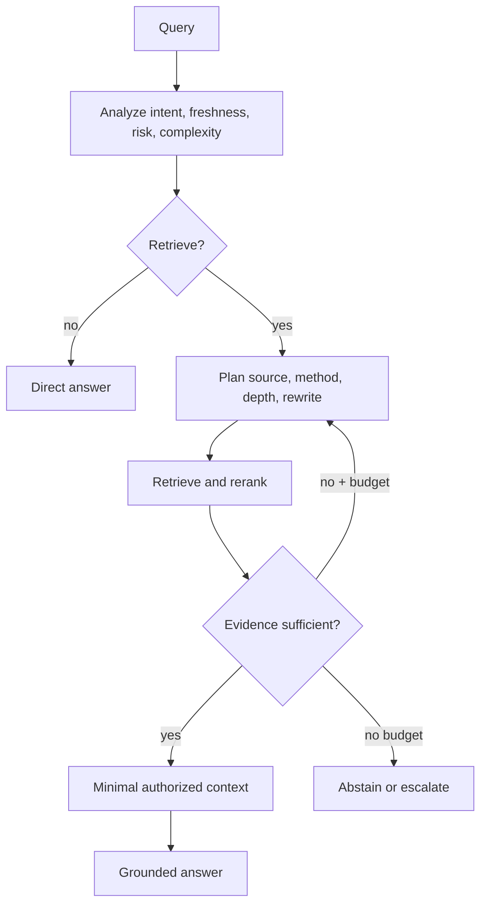

# Adaptive RAG: from fixed pipelines to bounded retrieval policies

Traditional RAG sends every request through one sequence: query → retrieve top-K → context → answer. Adaptive RAG asks a more useful engineering question: **what is the minimum retrieval and reasoning strategy required to answer this query reliably?** It is a policy-selection problem that balances answer quality against cost, latency, and risk.

## Why routing matters

Retrieval adds latency, token cost, irrelevant context, possible stale/conflicting evidence, and new safety boundaries. It is essential for private, current, or auditable facts, but it can harm a stable general-knowledge question. Linguistic complexity is not retrieval complexity: “What is Python?” may need no enterprise search, while “Which Python version is approved inside our company?” is short but requires governed retrieval.

## Adaptive decisions

| Decision | Question | Useful signals |
| --- | --- | --- |
| Necessity | Should the system retrieve? | private entity, recency, user demand for sources, risk |
| Strategy | Single, iterative, graph, SQL, web? | reasoning depth, information structure, scope |
| Source/method | BM25, dense, hybrid, graph, SQL, API? | identifier, semantic intent, relationship, numeric/current data |
| Transformation | Rewrite, expand, decompose? | ambiguity, multi-hop requirements, retrieval failure |
| Depth | How much evidence? | uncertainty, comparison, diversity, context budget |
| Continuation | Is evidence sufficient? | relevance, freshness, authority, citation coverage |

The original [Adaptive-RAG paper](https://arxiv.org/abs/2403.14403) routes questions among no-retrieval, single-step, and iterative retrieval according to predicted complexity. Modern systems extend that idea to execution feedback: [Self-RAG](https://arxiv.org/abs/2310.11511) considers retrieval/reflection during generation, [CRAG](https://arxiv.org/abs/2401.15884) evaluates weak retrieval and applies correction, and [FLARE](https://arxiv.org/abs/2305.06983) retrieves when generation indicates uncertainty.

## Choose the representation, not a favorite tool

Use lexical retrieval for exact policy IDs and error codes; dense retrieval for paraphrases; hybrid retrieval for mixed cases; graph retrieval for relational or corpus-wide questions; SQL for numeric analytics; and web/API retrieval for governed current external facts. Microsoft GraphRAG’s [Local, Global, and DRIFT search](https://microsoft.github.io/graphrag/) illustrate that even graph retrieval should be routed by question shape rather than applied everywhere.

## Evaluation and safety

Adaptive RAG adds a new failure boundary: **strategy selection**. Measure routing accuracy and its confusion matrix, retrieval/context quality per selected route, extra calls, loop length, latency, cost, and evidence sufficiency. Compare every adaptive route to a simple fixed baseline. More autonomy is justified only when the quality or risk improvement is worth its operational cost.

Keep the controller bounded: explicit tools and sources, authorization before retrieval, maximum steps/cost/context, traceable rewrites, evidence-quality checks, and abstention after the recovery budget is exhausted. The transition to agentic RAG is a transition to more decisions—not a reason to remove these boundaries.

## Learn by building

The [Adaptive RAG notebook track](../notebooks/adaptive-rag/README.md) teaches the progression from fixed retrieval to routing, transformations, source selection, corrective loops, evaluation, and a production capstone with deterministic Python before optional LangGraph, Haystack, LlamaIndex, or GraphRAG integrations.
