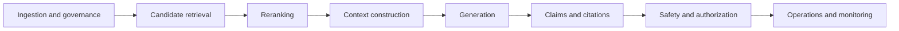

# Evaluating RAG systems: a diagnostic discipline

RAG evaluation is not one final-answer score. A fluent answer can hide a retriever that missed the authoritative source, a context builder that removed the needed passage, a citation that does not support its claim, an authorization leak, or latency that makes the product impractical. This guide follows One+i’s [Evaluating RAG systems beyond the demo](https://oneplusi.io/blog/article/evaluating-rag-systems/) and the linked **PolicyAssist RAG Evaluation Lab**.

## Evaluate the whole system

The six promises are separate: **answer** (useful and correct), **evidence** (grounded), **retrieval** (finds relevant material), **citation** (verifiable), **safety** (bounded and permission-aware), and **operations** (fresh, observable, fast, and affordable). A change can improve one promise while harming another, so report a metric vector and failure slices rather than a single “RAG score.”

## A representative dataset is the first control

Each evaluation record should carry a question, reference answer or acceptance criteria, relevant documents and passages, expected citations, question type, difficulty, freshness requirements, authorization constraints, business severity, and expected behavior (`answer`, `abstain`, or `escalate`). Include factual, synthesis, multi-hop, temporal, conflicting, unanswerable, permission-boundary, and adversarial questions. Add **impossible-without-corpus** cases so the foundation model cannot mask a broken retriever with general knowledge.

## Metrics by failure boundary

| Boundary | Measure | Diagnostic question |
| --- | --- | --- |
| Candidate retrieval | Recall@K, Precision@K, hit rate, MRR | Did the correct evidence appear and how early? |
| Reranking | nDCG@K, reranked recall | Did the strongest evidence move into the usable range? |
| Context | Context recall, precision, freshness, ordering | Did the model actually see sufficient, authorized evidence? |
| Generation | Correctness, relevance, completeness, faithfulness | Is the answer right, useful, complete, and supported? |
| Citations | Validity, correctness, completeness, precision | Does each factual claim map to supporting evidence? |
| Safety | Refusal/abstention accuracy, leak rate, attack success rate | Does the system remain inside evidence and policy boundaries? |
| Operations | P50/P95 latency, cost/query, no-result rate, drift | Can the system sustain the workflow after release? |

**Retrieval is not ranking, and ranking is not context.** Measure candidate recall, reranked top-K quality, and useful evidence in the final context separately. A relevant chunk can be retrieved at rank 37, promoted by a reranker, then dropped by a context budget or metadata filter.

## Correctness and grounding can disagree

| | Grounded | Ungrounded |
| --- | --- | --- |
| Correct | Ideal RAG behavior | Lucky answer from parametric knowledge |
| Incorrect | Faithful use of stale or low-authority evidence | Hallucination or unsupported assertion |

For high-impact answers, move from answer-level review to claim-level review: extract material claims, resolve citations, test support/entailment, label severity, and aggregate citation completeness. A mostly supported answer can still contain one critical unsupported policy claim.

## LLM judges are instruments, not truth

LLM-as-a-judge can scale nuanced assessments, but evaluate the judge itself against expert labels. Test verbosity bias, position bias, reference bias, prompt sensitivity, and domain weakness. Version prompts and rubrics; use agreement, confusion matrices, correlations, and Cohen’s kappa; send high-severity or uncertain disagreements to human review. Deterministic checks should remain deterministic where possible: source IDs, authorization filters, exact policy versions, schema validity, and latency budgets do not need an LLM judge.

## Stress testing and release gates

Deliberately inject noise, bury evidence, add conflicting versions, remove required evidence, paraphrase queries, and embed malicious instructions in retrieved documents. Treat retrieved text as **data**, never as instructions. Enforce authorization before retrieval and context construction, then measure unauthorized-retrieval rate, sensitive-context exposure, refusal correctness, unsupported-answer rate, and attack success rate.

Offline evaluation is a release gate; online evaluation is the operating layer. Traces should connect query, rewrites, retrieved chunks, reranker scores, final context, model calls, citations, judge scores, latency, tokens, cost, user feedback, and escalation. Gate releases on high-severity slices and critical constraints—not an average score.

## Learn by investigating PolicyAssist

The [RAG Evaluation Lab](../notebooks/evaluation/README.md) uses an evolving Northstar Insurance scenario to make each metric necessary. Learners inherit a system that looks good in a demo and must decide whether it is ready for production. The notebooks cover the broken baseline, dataset design, retrieval, context, generation, claims/citations, judges, robustness/abstention, security/permissions, architecture comparison, production tracing, and a release-review capstone.

## References

- [One+i: Evaluating RAG systems beyond the demo](https://oneplusi.io/blog/article/evaluating-rag-systems/) — course conceptual framework and practical evaluation playbook.
- [RAGAS](https://arxiv.org/abs/2309.15217) — automated RAG metrics including faithfulness, answer relevance, and context metrics.
- [RAGBench](https://arxiv.org/abs/2407.11005) and [RAGChecker](https://arxiv.org/abs/2408.08067) — component-level and explainable RAG evaluation research.
- [Ragas metrics documentation](https://docs.ragas.io/en/stable/concepts/metrics/available_metrics/), [DeepEval metrics](https://deepeval.com/docs/metrics-introduction), and [TruLens RAG Triad](https://www.trulens.org/getting_started/core_concepts/rag_triad/) — maintained implementation references.
