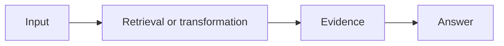

# Tutorial title

> One-sentence outcome: what the learner will be able to build or explain.

**Level:** Beginner / Intermediate / Advanced  \
**Time:** 30–60 minutes  \
**Prerequisites:** links to earlier lessons  \
**Primary tools:** list only the tools used in this lesson

## Learning objectives

By the end, the learner can:

- Explain …
- Implement …
- Measure …

## Why this matters

Describe the user problem, the RAG failure mode being addressed, and when this pattern is not appropriate.

## Architecture

Add a small Mermaid diagram when the relationships or sequence are easier to understand visually.

## Setup

Give copy-paste commands from a clean checkout. Document required environment variables without committing secrets.

## Build it

Explain each important step, then link to the complete runnable example. Prefer typed inputs and outputs, explicit source metadata, and small fixtures.

## Inspect the result

Show an expected result and explain how to verify citations, retrieval results, schema validity, or another observable property.

## Experiment

Change one variable, such as chunk size, `top_k`, embedding model, reranker, or prompt. Record what changed and why.

## Failure modes

Document at least one likely failure, how to reproduce it, and the first diagnostic to inspect.

## Exercise

Give the learner a bounded task with a success criterion, for example: “Improve recall@5 by 10 percentage points without doubling latency.”

## Checkpoint

Link to the relevant quiz questions or add three short questions with answers and explanations.

## Sources

Prefer the original paper, official documentation, or the maintained project repository. Explain what each source contributes.
