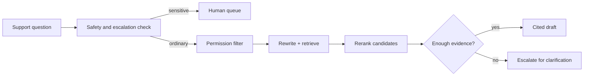

# Intermediate use case: customer-support assistant

This project combines the intermediate retrieval lessons into a support assistant that respects tenant access, rewrites vague questions, reranks candidates, cites its evidence, and escalates sensitive requests.

**Level:** Intermediate  \
**Time:** 90 minutes  \
**Prerequisites:** complete the [intermediate path](../../curriculum/intermediate/README.md)

## Scenario

Support agents ask about a fictional Acme service. Public help articles are available to every tenant; private account notes are available only to the matching tenant. Refund and cancellation requests require human review.



## Run it

```bash
PYTHONPATH=. python use-cases/customer-support/app.py acme "How do I rotate an API key?"
PYTHONPATH=. python use-cases/customer-support/app.py acme "Please refund my last invoice"
```

The guided companion is [`customer_support.ipynb`](customer_support.ipynb).

## Completion rubric

- [ ] Tenant filtering happens before retrieval.
- [ ] Supported answers contain source IDs.
- [ ] Weak evidence produces escalation rather than invention.
- [ ] Refund/cancellation requests are routed to a human.
- [ ] Tests cover public, private, cross-tenant, and sensitive questions.
- [ ] You record latency and retrieval-quality trade-offs.
