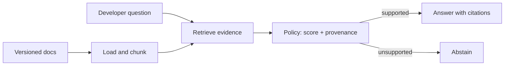

# Beginner capstone: documentation assistant

Build a small assistant that answers questions from versioned product documentation, shows traceable sources, and abstains when the corpus does not contain enough evidence.

**Level:** Beginner  \
**Time:** 60–90 minutes  \
**Prerequisites:** complete the [beginner path](../../curriculum/beginner/README.md)

## Scenario

A developer asks how a fictional product works. The assistant may answer only from the checked-in documentation. It must expose source IDs and refuse questions outside the corpus.



## Run it

From the repository root:

```bash
PYTHONPATH=. python use-cases/documentation-assistant/app.py "How do I rotate an API key?"
PYTHONPATH=. python use-cases/documentation-assistant/app.py "How do I order lunch?"
```

The first question should return evidence from `api-keys.md`; the second should abstain.

The guided notebook is [`documentation_assistant.ipynb`](documentation_assistant.ipynb). It explains the design, runs the app, inspects citations, and provides the capstone exercise.

## Completion rubric

- [ ] The assistant loads all documents from the fixture directory.
- [ ] Every supported response includes a source ID and filename.
- [ ] Unsupported questions abstain with a visible reason.
- [ ] Retrieval and answer behavior have automated tests.
- [ ] You add one document and one question without changing the retrieval module.
- [ ] You record one limitation and propose an embedding or hybrid-retrieval upgrade.

## Production discussion

This baseline is intentionally local and lexical. A production documentation assistant also needs document-level authorization, freshness and version filters, ingestion monitoring, prompt-injection handling for untrusted docs, latency and cost budgets, and a representative evaluation set.
